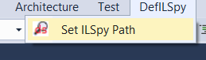
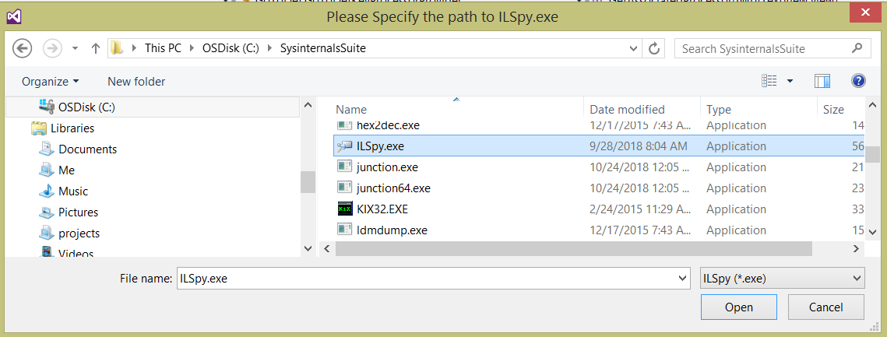
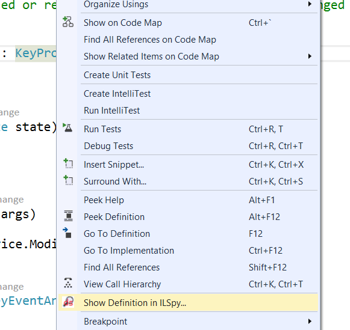
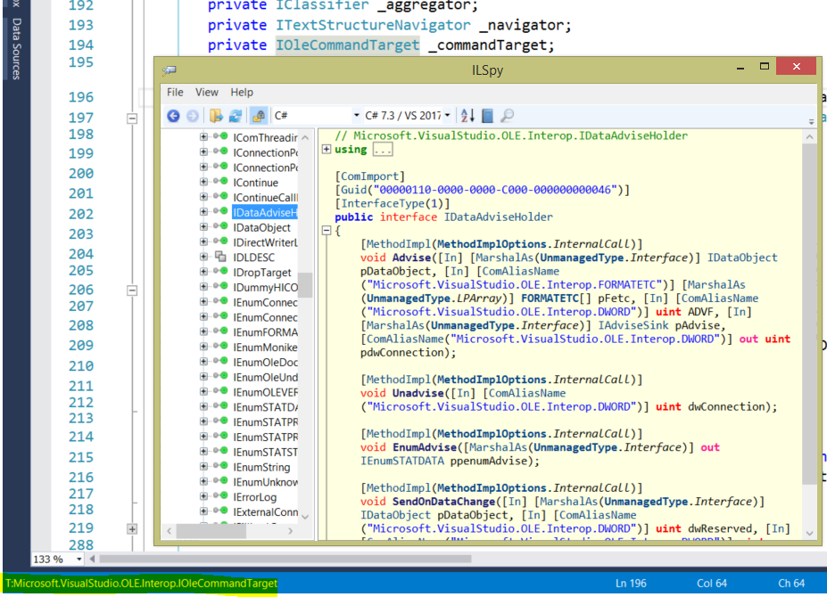

# DefSpy 

## Overview

A Visual Studio extension that shows definition of an external type/method in ILSpy.
The author wants to thank the authors of the following tools for their inspirations:

GoToILSpy for VS2015: https://marketplace.visualstudio.com/items?itemName=MarekPokornyOVA.GoToILSpyforVS2015
LinqPad: https://www.linqpad.net/

## How to Use

1. Download and Install DefSpy.vsix
2. Set up path to ILSpy.exe

3. Compile your project, right click a class or method, select "Show Definition in ILSpy..."

4. Decompiled code will be shown in ILSpy

5. Happy Coding ;D
